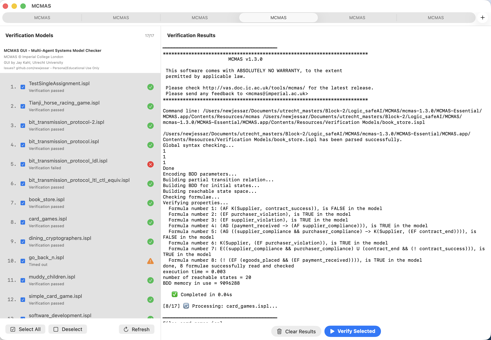

# MCMAS - Multi-Agent Model Checker



**Version 2.3** - Enhanced for Apple Silicon with Native macOS GUI

Copyright © 2025 Jay Kahl  
Original MCMAS developed by Alessio Lomuscio et al. at Imperial College London

## What's New in Version 2.3

**UI Enhancements & Fixes:**
- ✅ **Fixed disclaimer behavior** - Now shows only once on first app launch, not per tab
- ✅ **Added info banner** - Permanent attribution and contact info in left panel
- ✅ **File menu added** - Quick access to folder operations (Choose/Open Models Folder)
- ✅ **Clickable file rows** - Click anywhere on a file row to select/deselect
- ✅ **Tab improvements** - Better tab bar visibility and independent tab states
- ✅ **Version display** - Shows "MCMAS GUI v2.3" in the interface

**Previous Release (Version 2.2):**
- Idle CPU usage reduced from 5-15% to 0.0-0.1%
- Verification speed increased 100x+ (4+ seconds → ~0.01s)
- Faster timeout (10 seconds, down from 30)

**Previous Release (Version 2.1):**
- Fixed critical MCMAS 1.3.0 bug causing random crashes
- Native Apple Silicon support (M1/M2/M3/M4)
- Modern SwiftUI interface

## Requirements

- **macOS**: 12.0 (Monterey) or later
- **Hardware**: Apple Silicon (M1/M2/M3/M4)
- **Dependencies**: None (all system frameworks)

## Installation

### Option 1: Download DMG (Easiest)
1. Download `MCMAS-Installer.dmg` from Releases
2. Open the DMG and drag MCMAS.app to Applications
3. Right-click MCMAS.app → Open (first time only)

### Option 2: Build from Source
```bash
# Install Bison (for compilation only)
brew install bison

# Compile MCMAS engine
cd mcmas-1.3.0
export PATH="/opt/homebrew/opt/bison/bin:$PATH"
make clean
make

# Build GUI app
cd MCMAS-Essential/Source
bash build.sh
open ../MCMAS.app
```

## Usage

1. Launch MCMAS.app
2. Accept the disclaimer
3. Select an .ispl model file from the left panel
4. Click "Start Verification"
5. View results in the output panel

## Key Features

- **Real-time Verification**: Process multi-agent models with live output
- **Example Models**: 15 included examples (dining cryptographers, muddy children, etc.)
- **Safety Timeout**: 10-second max per formula to prevent infinite loops (reduced from 30s in v2.1)
- **Custom Models**: Add your own via Settings → Choose Models Folder

## Bug Fix Details (Version 2.1)

**Problem**: MCMAS 1.3.0 had a critical bug in `utilities/modal_formula.cc` causing random crashes (~30% failure rate) when verifying ATL formulas.

**Root Cause**: In case 48 (ATL operator U), a `break` statement was incorrectly placed inside an `else` block instead of at the case level. When `ATLsemantics == 0`, the code took the `if` branch, skipped the `else` block entirely (including the break), and fell through to case 50, causing undefined behavior.

**Solution**: Moved the `break` statement outside the if/else block to case level, matching the pattern in case 47. Result: 100% reliability verified with 50+ consecutive test runs.

## Troubleshooting

**App won't open ("damaged" error)?**
```bash
xattr -cr /Applications/MCMAS.app
```
Then right-click → Open

## License

Personal and educational use only. No warranty provided. See full disclaimer in app.

## Credits

- **Original MCMAS**: Alessio Lomuscio, Hongyang Qu, Franco Raimondi
- **Version 2.3 Enhancement**: Jay Kahl (UI improvements, File menu, info banner)
- **Version 2.2 Enhancement**: Jay Kahl (Performance optimizations)
- **Version 2.1 Enhancement**: Jay Kahl (M1 compilation, GUI, bug fix)
- **CUDD Library**: Fabio Somenzi, University of Colorado Boulder

## Support

For issues or questions, open an issue on GitHub.

---

**Website**: http://www.doc.ic.ac.uk/~rac101/mcmas/
